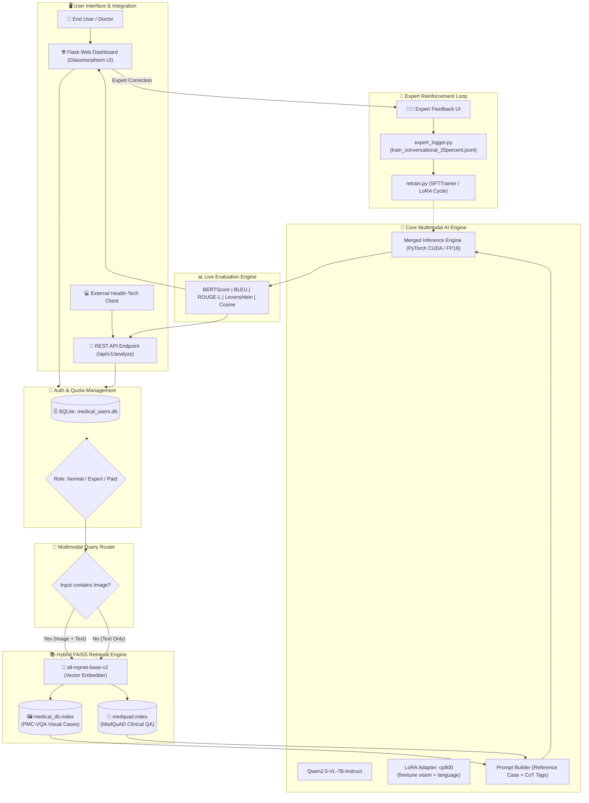
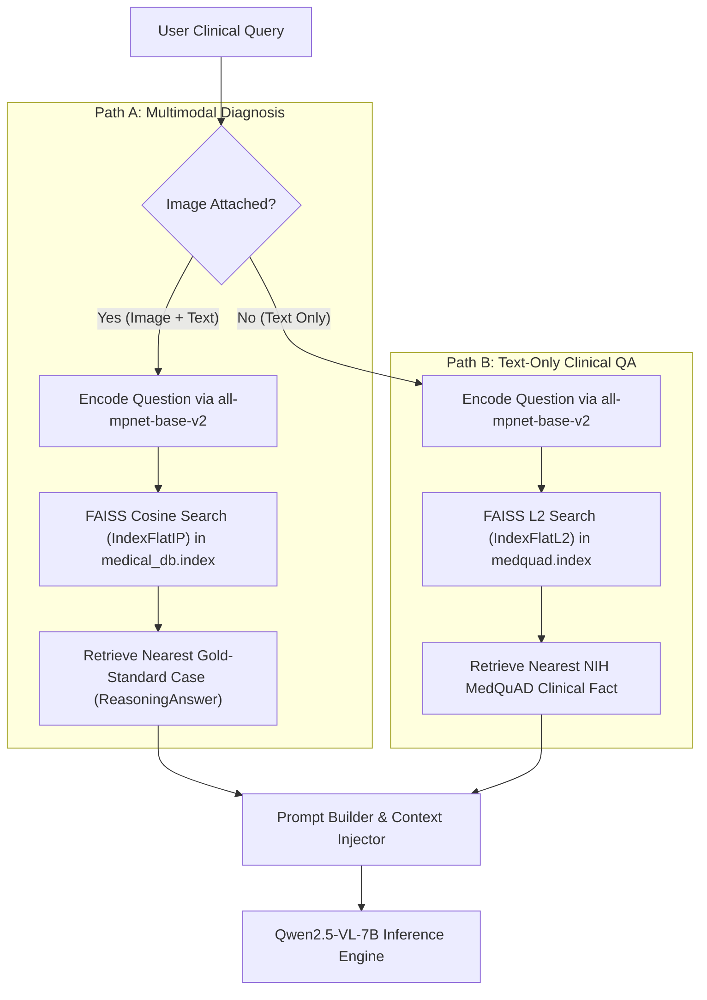
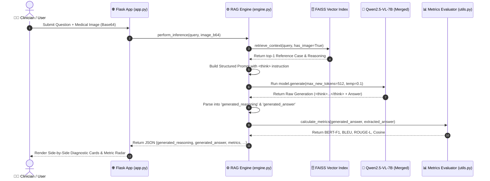

# 🏥 MedRAG: Multimodal Medical Vision-Language AI & Hybrid Clinical Intelligence System

[](https://www.python.org/)
[](https://pytorch.org/)
[](https://huggingface.co/)
[](https://github.com/unslothai/unsloth)
[](https://github.com/facebookresearch/faiss)
[](https://flask.palletsprojects.com/)

---

## 📌 Executive Summary

**MedRAG** is an end-to-end multimodal clinical intelligence platform developed for medical visual question answering (VQA) and clinical diagnostics. It bridges fine-tuned Vision-Language Models (VLMs) with a Hybrid Retrieval-Augmented Generation (RAG) architecture and a Human-in-the-Loop Expert Reinforcement pipeline.

The system is powered by **Qwen2.5-VL-7B-Instruct** fine-tuned on the **PMC-VQA** dataset using **Unsloth** and **PEFT / LoRA (Low-Rank Adaptation)** with structured Chain-of-Thought (`<think>...</think>`) clinical reasoning. In production, MedRAG uses dynamic query routing between visual and text FAISS vector databases, providing explainable step-by-step reasoning alongside live semantic and lexical evaluation metrics.

---

## 📑 Table of Contents

1. [Key Features](#-key-features)
2. [System Architecture](#-system-architecture)
3. [Project Directory Layout](#-project-directory-layout)
4. [Dataset & Knowledge Bases](#-dataset--knowledge-bases)
5. [Model Training & Fine-Tuning Pipeline](#-model-training--fine-tuning-pipeline)
   - [Hyperparameter Optimization](#1-hyperparameter-optimization-random-search)
   - [LoRA Parameter-Efficient Fine-Tuning](#2-lora-parameter-efficient-fine-tuning)
   - [Training Execution & Loss Trajectory](#3-training-execution)
   - [Model Checkpoints & Hugging Face Hub](#4-model-checkpoints--hugging-face-hub)
6. [Evaluation & Benchmark Results](#-evaluation--benchmark-results)
7. [Hybrid RAG Engine & Dynamic Routing](#-hybrid-rag-engine--dynamic-routing)
8. [End-to-End System Flow](#-end-to-end-system-flow)
9. [Human-in-the-Loop Expert Reinforcement](#-human-in-the-loop-expert-reinforcement)
10. [Web Platform & RESTful API](#-web-platform--restful-api)
    - [Web Application UI & SaaS Tiering](#web-application-ui--saas-tiering)
    - [RESTful External API Specification](#restful-external-api-specification)
11. [Installation & Setup Guide](#-installation--setup-guide)
12. [Step-by-Step Usage Guide](#-step-by-step-usage-guide)
    - [1. Building Vector Databases](#1-building-vector-databases-indexing)
    - [2. Running the Flask Server](#2-running-the-flask-server)
    - [3. Running Incremental Retraining](#3-running-incremental-retraining)
13. [Tech Stack & Dependencies](#-tech-stack--dependencies)
14. [License & Disclaimers](#-license--disclaimers)

---

## ✨ Key Features

- **Multimodal Visual Diagnostics**: Processes medical imagery (X-rays, CT scans, MRIs, pathology slides, ultrasound, surgical figures) alongside complex medical queries.
- **Explainable Chain-of-Thought (CoT)**: Explicitly separates diagnostic reasoning (`<think>...</think>`) from the final clinical answer for maximum transparency.
- **Hybrid Dynamic RAG**:
  - **Visual Queries**: Queries PMC-VQA clinical case vectors using cosine similarity search.
  - **Text Queries**: Queries MedQuAD medical knowledge vectors using Euclidean/L2 similarity search.
- **Live Multidimensional Metrics**: Evaluates model inferences in real-time using BERTScore (Semantic F1), SacreBLEU, ROUGE-L, Levenshtein Distance, and Cosine Vector Similarity against retrieved gold-standard references.
- **Continuous Learning & Expert Reinforcement**: Role-Based Access Control (RBAC) allows verified medical professionals to submit corrections, expanding the dataset for automated periodic retraining (`retrain.py`).
- **Production-Ready SaaS Platform**: User authentication (Bcrypt & Flask-Login), tiered monetization quotas (5 free queries), premium upgrades, and token-authenticated RESTful API (`X-API-KEY`).

---

## 🏛 System Architecture



---

## 📂 Project Directory Layout

```text
fyp baru/
│
├── PMC-VQA/                                    # Raw dataset snapshots & subsets
│   ├── train_conversational.jsonl             # Full conversational PMC-VQA training split
│   ├── test_conversational.jsonl              # Full conversational PMC-VQA test split
│   ├── train_conversational_10percent.jsonl   # 10% training subset
│   └── test_conversational_10percent.jsonl    # 10% evaluation subset
│
├── images/                                     # Medical image corpus (Figures, scans, slides)
│   ├── PMC9227514_polymers-...jpg
│   └── ...
│
├── static/                                     # Static assets for Flask web app
│   └── images/                                 # Web icons, backgrounds, UI media
│
├── templates/                                  # Frontend Jinja2 HTML templates
│   ├── landing.html                            # Public landing page with glassmorphism UI
│   ├── index.html                              # Interactive diagnostic dashboard & chat stream
│   ├── login.html                              # User authentication: Login
│   ├── signup.html                             # User registration with Role selection
│   └── docs.html                               # Interactive REST API documentation
│
├── app.py                                      # Main Flask web application & API routing
├── engine.py                                   # Hybrid RAG engine, model loading & vector search
├── models.py                                   # SQLAlchemy User model, RBAC & API key schemas
├── utils.py                                    # Metrics (BERTScore, BLEU, ROUGE, Levenshtein, Cosine)
├── expert_logger.py                            # Human-in-the-Loop expert correction logger
├── ingest.py                                   # FAISS indexer for PMC-VQA visual knowledge base
├── ingest2.py                                  # FAISS indexer for MedQuAD text knowledge base
├── retrain.py                                  # Incremental SFT retraining pipeline
├── requirements.txt                            # Python dependencies
│
├── Qwen_2_5_VL_7B_Instruct.ipynb               # Full Unsloth training, tuning & evaluation notebook
│
├── train_conversational_25percent.jsonl        # 25% training split (active training master)
├── test_conversational_25percent.jsonl         # 25% test split for benchmark validation
├── medquad.jsonl                               # MedQuAD clinical question-answering dataset
│
├── medical_db.index                            # Precomputed FAISS index for PMC-VQA cases
├── medical_metadata.json                       # Case metadata (Question, Answer, Thinking)
├── medquad.index                               # Precomputed FAISS index for MedQuAD QA
└── medquad_metadata.json                       # Text QA metadata for MedQuAD
```

---

## 🗃 Dataset & Knowledge Bases

### 1. PMC-VQA (PubMed Central Visual Question Answering)
- **Source**: Sourced from biomedical research papers in PubMed Central.
- **Modality**: Multimodal (Medical Image + Clinical Question + Step-by-Step Reasoning + Verified Answer).
- **Structure**:
  ```json
  {
    "messages": [
      {
        "role": "user",
        "content": [
          {"type": "image", "image": "images/PMC4886073_fig5_35770.jpg"},
          {"type": "text", "text": "What pathological finding is highlighted in the right lower lobe?"}
        ]
      },
      {
        "role": "assistant",
        "content": [
          {"type": "text", "text": "<think>\nVisual inspection shows hyperdense consolidation with air bronchograms in the right lower lobe consistent with lobar pneumonia.\n</think>\nLobar pneumonia."}
        ]
      }
    ]
  }
  ```

### 2. MedQuAD (Medical Question Answering Database)
- **Source**: NIH / National Library of Medicine certified health and disease repositories.
- **Modality**: Text-only comprehensive medical questions and clinical answers covering disease etiology, symptoms, diagnosis, and pharmacology.
- **Used For**: Text-only medical RAG queries when no patient image is provided.

---

## 🚀 Model Training & Fine-Tuning Pipeline

The complete training lifecycle was implemented in `Qwen_2_5_VL_7B_Instruct.ipynb` utilizing **Unsloth FastVisionModel** on an **NVIDIA A100-SXM4-40GB GPU**.

### 1. Hyperparameter Optimization (Random Search)
To maximize multimodal reasoning capability, a 5-trial random search was conducted over 500 representative clinical samples:

| Trial | Learning Rate | LoRA Rank ($r$) | LoRA Alpha ($\alpha$) | Batch Size | Validation Loss |
| :---: | :---: | :---: | :---: | :---: | :---: |
| **Trial 4** | **`2e-4`** | **64** | **64** | **16** | **1.3684 (Best)** |
| Trial 3 | `1e-4` | 128 | 128 | 16 | 1.3913 |
| Trial 2 | `1e-4` | 32 | 32 | 16 | 1.8220 |
| Trial 1 | `5e-5` | 64 | 64 | 16 | 1.9229 |
| Trial 5 | `5e-5` | 32 | 32 | 16 | 2.3931 |

### 2. LoRA Parameter-Efficient Fine-Tuning
- **Base Architecture**: `Qwen/Qwen2.5-VL-7B-Instruct` (8.5B parameters total).
- **Target Modules**: Applied to all vision layers, language layers, self-attention projections (`q_proj`, `k_proj`, `v_proj`, `o_proj`), and MLP modules.
- **Trainable Parameters**: `206,086,144` parameters (~**2.43%** of total weights).
- **Quantization**: 4-bit NormalFloat (NF4) with Double Quantization to optimize VRAM utilization.

### 3. Training Execution
- **Dataset Size**: 15,260 multimodal medical conversations (PMC-VQA split).
- **Epochs**: 2 full epochs (1,908 optimizer steps).
- **Optimizer**: `adamw_8bit` with Cosine Annealing Learning Rate Schedule and 50 warm-up steps.
- **Precision**: bfloat16 mixed precision with Unsloth gradient offloading and gradient checkpointing.
- **Checkpoints**: Evaluated every 100 steps, retaining the best checkpoint based on minimum validation loss (`eval_loss`).

### 4. Model Checkpoints & Hugging Face Hub
- The fine-tuned LoRA adapter checkpoint is published on the Hugging Face Hub:
  - 🔗 **Adapter Repo**: [`sarnsrun/qwen_2.5_VL-7B-Instruct_PMC-VQA_cp800`](https://huggingface.co/sarnsrun/qwen_2.5_VL-7B-Instruct_PMC-VQA_cp800)
- In `engine.py`, the base model and adapter are loaded and dynamically merged via `PeftModel.merge_and_unload()` for zero-latency inference.

---

## 📊 Evaluation & Benchmark Results

The fine-tuned model was evaluated on the held-out test split using a multi-faceted metric suite evaluating lexical precision, semantic alignment, and scientific exactness:

| Metric | Score | Description |
| :--- | :---: | :--- |
| **BERTScore Precision** | **`0.9507`** | Token-level semantic alignment against medical ground truth |
| **BERTScore Recall** | **`0.9416`** | Coverage of critical clinical concepts |
| **BERTScore F1** | **`0.9458`** | Harmonic mean of clinical semantic alignment |
| **ROUGE-L (F1)** | **`0.7724`** | Longest common clinical phrase overlap |
| **SacreBLEU Score** | **`64.76`** | N-gram diagnostic phrasing precision |
| **Levenshtein Ratio** | **`0.8012`** | Character/string edit distance similarity |
| **Sentence Cosine Similarity** | **`0.5918`** | Dense vector similarity (`all-MiniLM-L6-v2`) |
| **Strict Accuracy** | **`6.00%`** | Exact character-for-character string match |
| **Relaxed Accuracy** | **`8.00%`** | Substring containment match |

> **Clinical Insight**: While strict exact string matches in open-ended medical VQA are low due to natural clinical phrasing variations (e.g., *"Aortic Arch"* vs. *"Aortic arch aneurysm present"*), the **BERTScore F1 of 0.9458** and **ROUGE-L of 0.7724** prove that the model consistently captures correct medical diagnoses and anatomical entities.

---

## 🔍 Hybrid RAG Engine & Dynamic Routing

MedRAG implements an intelligent multi-index retrieval system in `engine.py`:



1. **Path A (Visual Query + Image)**:
   - Queries `medical_db.index` (PMC-VQA vector store).
   - Retrieves historical expert clinical cases containing both verified reasoning and final diagnosis.
2. **Path B (Text-Only Medical Inquiry)**:
   - Queries `medquad.index` (MedQuAD vector store).
   - Retrieves structured NIH/NLM medical knowledge chunks matching the clinical condition.

---

## ⚡ End-to-End System Flow



---

## 🔄 Human-in-the-Loop Expert Reinforcement

MedRAG features an active learning loop designed to continuously improve clinical precision over time:

1. **Role-Based Access Control (RBAC)**:
   - Users register with `normal` or `expert` roles.
   - Only accounts with `expert` credentials unlock the **Expert Reinforcement Panel** in the UI.
2. **Correction Logging (`expert_logger.py`)**:
   - If an AI response is sub-optimal, an expert inputs the validated diagnosis.
   - The system formats the correction with `<think>` tags and appends it to `train_conversational_25percent.jsonl`.
3. **Automated Retraining (`retrain.py`)**:
   - The SFT retraining pipeline loads the updated conversational dataset and fine-tunes the LoRA adapter over the new expert knowledge.
   - Model checkpoints are exported to `./reinforced_medical_model` and seamlessly hot-reloaded into the inference engine.

---

## 💻 Web Platform & RESTful API

### Web Application UI & SaaS Tiering
- **Landing Page (`landing.html`)**: Interactive showcase with live typewriter animations, floating JSON payloads, architecture cards, and instant onboarding.
- **Diagnostic Console (`index.html`)**: Glassmorphism chat stream featuring image drag-and-drop, step-by-step thinking accordions, comparative diagnostic cards, and real-time metric scoreboards.
- **Monetization & Quota Engine**:
  - Free Tier: Limited to `5` queries.
  - Premium Tier: Unlimited inferences + auto-generated API Key (`MED-XXXX...`).

---

### RESTful External API Specification

Developers can integrate MedRAG into external Hospital Information Systems (HIS) and Electronic Health Record (EHR) platforms.

#### **Endpoint**: `POST /api/v1/analyze`

#### **Headers**:
| Header | Value | Description |
| :--- | :--- | :--- |
| `Content-Type` | `application/json` | Request payload format |
| `X-API-KEY` | `MED-YOUR_API_KEY_HERE` | User authentication key |

#### **Request Body**:
```json
{
  "text": "What abnormality is present in this brain MRI scan?",
  "image": "data:image/jpeg;base64,/9j/4AAQSkZJRgABAQEASABIAAD..."
}
```

#### **Response Body (`200 OK`)**:
```json
{
  "status": "success",
  "version": "v1.0",
  "api_usage": 12,
  "results": {
    "generated_reasoning": "T2-weighted MRI demonstrates a well-circumscribed hyperintense extra-axial mass along the cerebral convexity with adjacent dural tail enhancement...",
    "generated_answer": "Meningioma.",
    "extracted_reasoning": "Reference case shows extra-axial mass with dural tail sign...",
    "extracted_answer": "Meningioma",
    "metrics": {
      "accuracy": 1.0,
      "bert_f1": 0.9821,
      "bleu": 100.0,
      "f1_score": 1.0,
      "cosine": 0.9942
    }
  }
}
```

---

## 🛠 Installation & Setup Guide

### Prerequisites
- **Operating System**: Windows 10/11, Linux (Ubuntu 20.04+), or macOS
- **GPU**: NVIDIA GPU with CUDA support (Recommended: 12GB+ VRAM for local inference; CPU inference also supported)
- **Python**: Python `3.10` or `3.11`

### 1. Clone the Repository
```bash
git clone https://github.com/your-username/medrag.git
cd medrag
```

### 2. Create and Activate a Virtual Environment
```bash
# Windows PowerShell
python -m venv venv
.\venv\Scripts\Activate.ps1

# Linux / macOS
python3 -m venv venv
source venv/bin/activate
```

### 3. Install Required Dependencies
```bash
pip install --upgrade pip
pip install -r requirements.txt
```

---

## 📖 Step-by-Step Usage Guide

### 1. Building Vector Databases (Indexing)

Before launching the server for the first time, generate the FAISS vector indices for PMC-VQA and MedQuAD:

```bash
# Ingest PMC-VQA Visual Cases into medical_db.index
python ingest.py

# Ingest MedQuAD Clinical Cases into medquad.index
python ingest2.py
```

### 2. Running the Flask Server

Start the application on `http://localhost`:

```bash
python app.py
```

- **Landing Page**: Open `http://127.0.0.1/` in your browser.
- **Sign Up / Login**: Navigate to `/signup`, create an account (select `expert` to test feedback features), and log in.
- **Diagnostic Dashboard**: Upload an image, input your clinical query, and review the generated reasoning and real-time metric benchmarks.
- **API Documentation**: Visit `http://127.0.0.1/docs` for the interactive API playground.

### 3. Running Incremental Retraining

To execute a fine-tuning cycle incorporating newly logged expert feedback:

```bash
python retrain.py
```

---

## 🧰 Tech Stack & Dependencies

| Component | Technology |
| :--- | :--- |
| **Vision-Language Foundation** | `Qwen/Qwen2.5-VL-7B-Instruct`, `unsloth`, `transformers`, `peft` |
| **Vector Embeddings** | `sentence-transformers/all-mpnet-base-v2`, `all-MiniLM-L6-v2` |
| **Vector Search Engine** | `FAISS (faiss-cpu / faiss-gpu)` |
| **Evaluation Metrics** | `bert_score`, `sacrebleu`, `rouge_score`, `Levenshtein`, `scikit-learn` |
| **Backend Framework** | `Flask`, `Flask-Login`, `Flask-SQLAlchemy`, `Flask-Bcrypt` |
| **Database** | `SQLite` (`medical_users.db`) |
| **Frontend Technologies** | HTML5, CSS3 Glassmorphism, JavaScript, FontAwesome, Google Inter Font |

---

## 📜 License & Disclaimers

- **License**: Academic Free License (AFL-3.0) / MIT Open License.
- **Clinical Disclaimer**: **MedRAG is an AI research prototype and educational system.** It is not an FDA-approved medical device and should not be used as the sole basis for clinical diagnosis, treatment decisions, or emergency medical procedures without oversight by a licensed medical professional.

---

<div align="center">
  <sub>Developed as a Final Year Project (FYP) in Multimodal Artificial Intelligence and Clinical Natural Language Processing.</sub>
</div>
